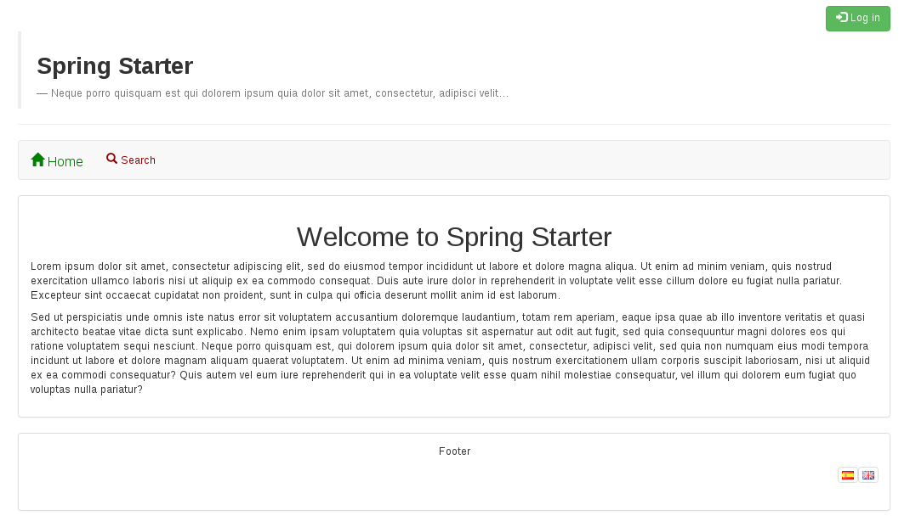
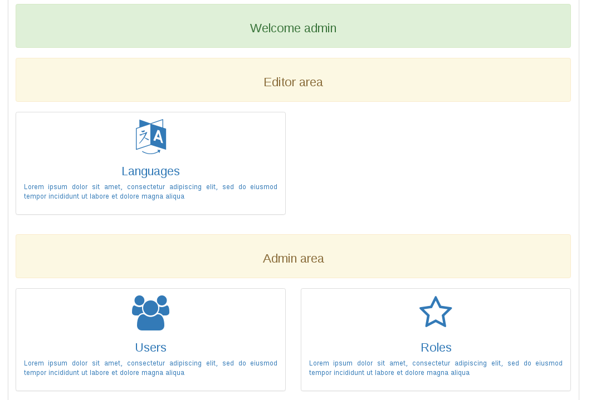
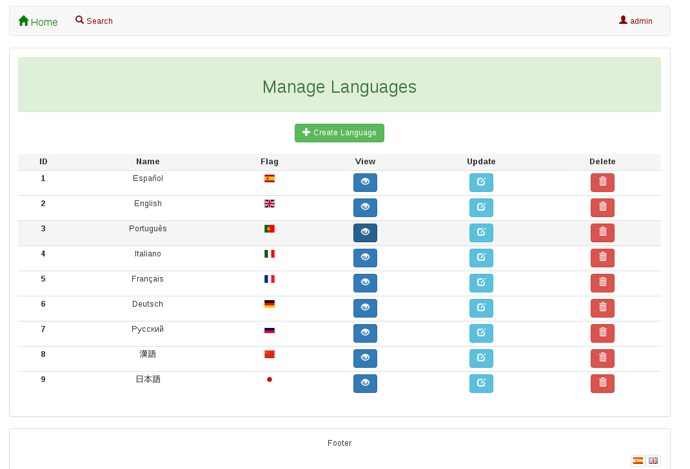
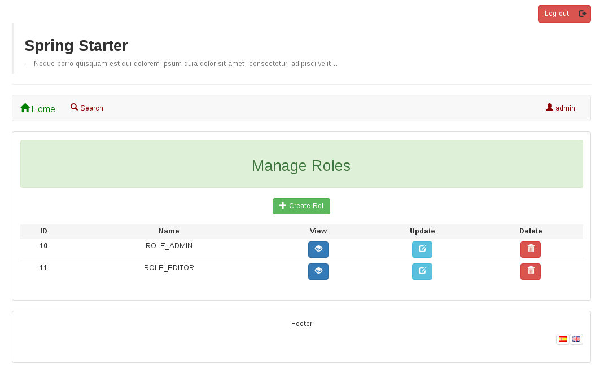
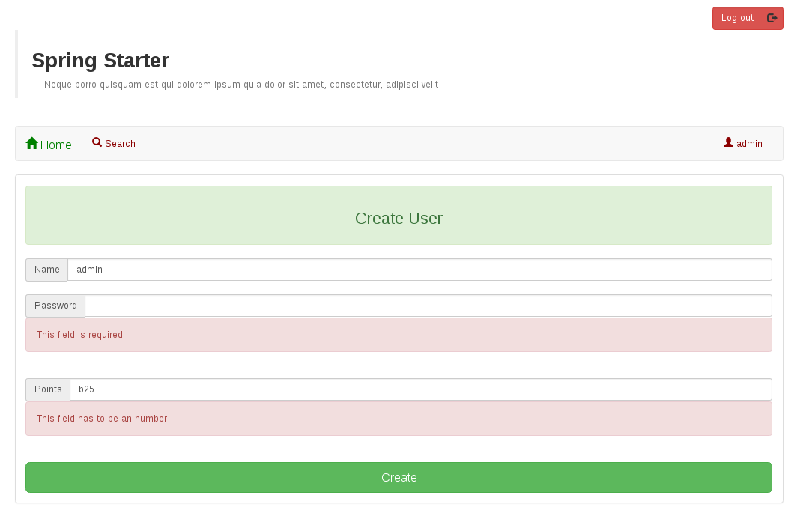
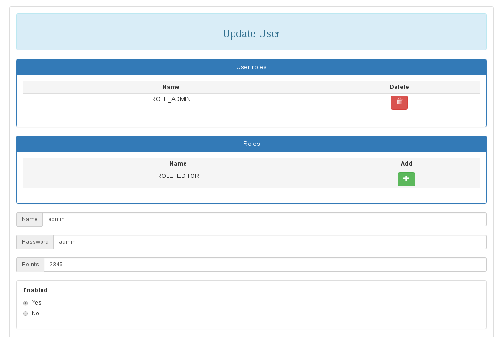

# Spring Starter

Spring-starter provides a simple architecture of a Spring web application full of useful tools. It has a flexible abstraction so it is easy to add more features.

## Gradle and Spring Boot 
This web application is using the Spring Boot Gradle Plugin, allowing you to package executable jar or war archives, run Spring Boot applications and use the dependency management provided by spring-boot-dependencies.

## JPA and Hibernate
The Java Persistence API is a POJO persistence API for object/relational mapping. It contains a full object/relational mapping specification supporting the use of Java language metadata annotations and/or XML descriptors to define the mapping between Java objects and a relational database. Directly, JPA can't be used for persistence. Persistence, means which deals with storing and retrieving of application data. It needs an ORM implementation to persist the java objects into DB like Hibernate

## Spring Security
Don't roll your own security unless you're an expert. Spring Security is a Java/Java EE framework that provides authentication, authorization and other security features for enterprise applications. 
The security of this web application is configured *security.xml*. There are two roles *ROLE_ADMIN* (can manage users, roles and languages) and *ROLE_EDITOR* (can manage languages).

## Dozer
A mapping framework is useful in a layered architecture where you are creating layers of abstraction by encapsulating changes to particular data objects vs. propagating these objects to other layers (i.e. external service data objects, domain objects, data transfer objects, internal service data objects). Dozer bean is configured in the file *mapper.xml*.

## Tiles, Bootstrap and Font Awesome
In the file *tiles-definitions.xml* you can create your owns templates. There is one template *defaultTemplate* which provides a header, menu, content and a footer.
Spring-template comes with a responsive design by Bootstrap3 and JQuery 1.12.3 (for best compatibility). You can use the set of icons of Bootstrap and Font Awesome as well.

There is a full User Interface for managing users, roles and languages:
 
 
 
 

 
 
 
 

 
 
 
 

 
 
 
 

 
 
 
 

 
 
 
 

